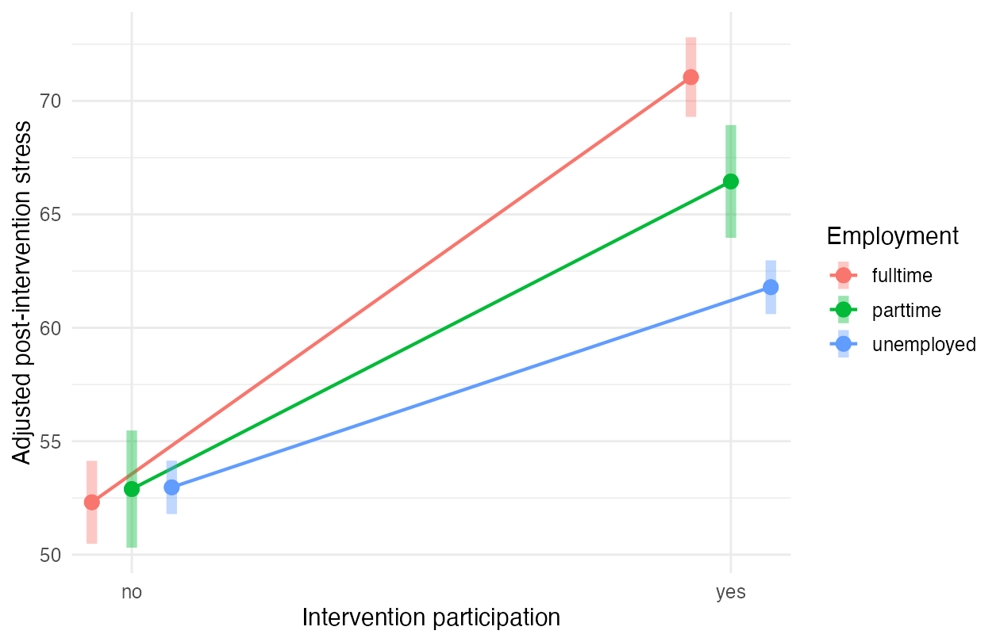

# Stress Intervention: Baseline-Adjusted ANOVA

An R analysis of whether the association between intervention participation and post-intervention stress differs by employment status, adjusting for baseline stress. The supplied coursework dataset contains 320 parents (168 participants and 152 nonparticipants).

## Results

The intervention × employment interaction improves the additive model: **F(2, 313) = 34.98, p < .001**, with an increase in R² from 0.9236 to 0.9376 (ΔR² = 0.0140). These values were recomputed with `analysis.R` on 8 October 2026.

| Employment | Adjusted stress difference, participation minus nonparticipation | 95% CI |
| --- | ---: | ---: |
| Full-time | 18.74 | [16.71, 20.77] |
| Part-time | 13.56 | [10.85, 16.27] |
| Unemployed | 8.82 | [6.82, 10.83] |

Intervals and p-values use a Bonferroni adjustment across the three contrasts. Higher post-intervention stress is associated with participation in each group. The quasi-experimental design does **not establish that the intervention caused these differences**.



## Run

Install R and the analysis packages:

```r
install.packages(c("emmeans", "ggplot2"))
```

From the repository root:

```bash
Rscript analysis.R
```

The script fits additive and interaction models, exports adjusted and standardized contrasts, and saves the figure. Standardization uses the sample SD of post-intervention stress; it is not a residual-SD effect size.

## Files

```text
Stress-Intervention-ANOVA/
├── analysis.R
├── data/stress_intervention.txt
├── docs/original_report.docx
├── results/                 # Recomputed tables, figure, model output, R session
├── .gitignore
└── README.md
```

The original report is retained for context; the findings above and CSV tables are readable directly on GitHub. Dataset fields are `employmentStatus`, `intervention`, `stress1` (baseline), and `stress2` (post-intervention). The data were supplied for the course; the repository does not document an independent empirical sampling protocol.

Laura M. Fetz
